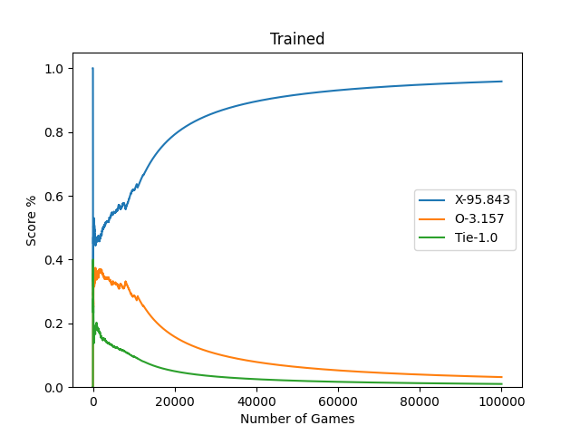
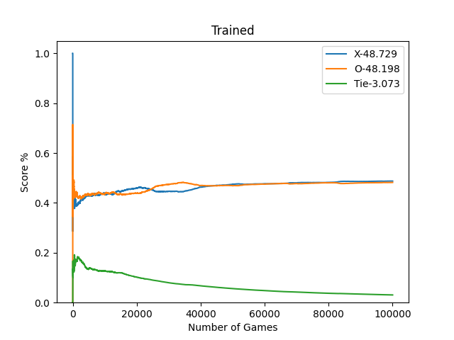
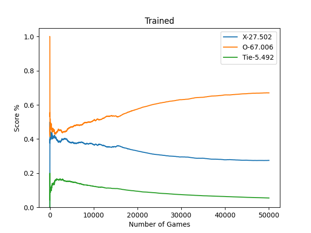
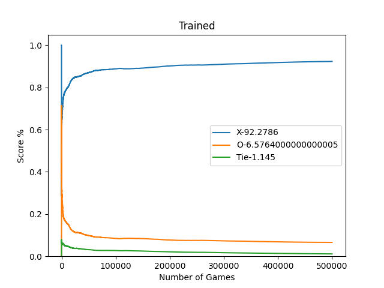
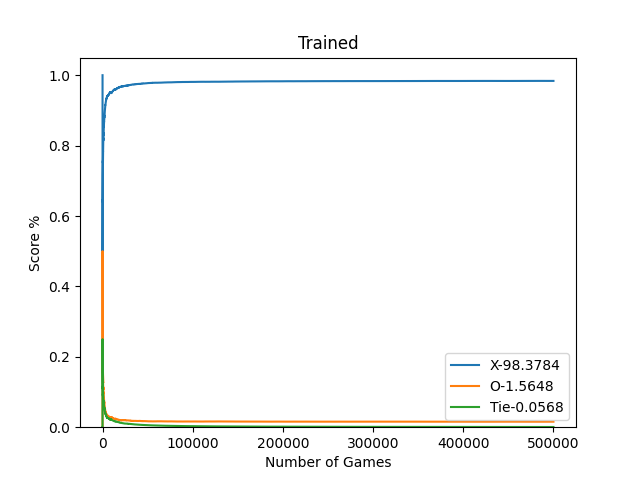

## Q learing with neural netowrks, but with only optimized q table.

# Steps to run the code
1) Clone the repository
2) Install the requirements using the command 
3) Play around the hyper-parameters in the code to see the results.
4) Run the code using the command
```bash
pip install -r requirements.txt
python "tic_tac_toe[ai].py"
```
# results
The game can be played for any numbered sqaures, to make it simpler we play it in a simlpe 3X3. 
### 1) <u>When Agent plays against an agent and agentX always plays first</u>

alpha = 0.25

gamma = 0.95

epsilon = 200(i.e has non-zero chance of random explorartion for 200 games and then becomes deterministic)

reward -> 1 if we win and -1 for draw and loosing


#### <u>observation</u>:- 
When given the opurtunity for x to always play first, There seems to a bias for first player, due to which X easily learns to win a similar agent playing second.

### 2) <u>When Agent plays against an agent and first player is choosen randomly</u>

hyper-parameters same as the previous one.


#### <u>observation</u>:-
This is a bit intuitive and as expected. As seen earlier, the first player has a higher chance of winning the game and when we asssign who is first with an equal chance to both, we obtain a win rate of 50-50. so both x and o agent converge at 50 with their win-rate.

for example:- here X is picked 1/3 times as first and O agent gets 2/3rd chance of being first. This means the win-rate should be higher for O agent(33-66). Which the below plot proves.


### 3) <u>When Agent plays against a random agent</u>

hyper-parameters same as the previous one.


#### <u>observation</u>:-
Here, compared to playing with an agent, the agent strugles to dominate the random player. It takes the higest number of games to finally have a dominating win-rate, against a random agent. This can be due to the fact that, the random agent confuses the agent by ofc playing randomly, This results in sometimes the agent un learning some strategies and learning strategies that are not optimal.

### 4) <u>When Agent plays against a random agent and first player is the agent</u>

hyper-parameters same as the previous one.


#### <u>observation</u>:-
This might look very mis-leading giving the impression that the agent has learned to win all the time, but this is not the case. Since the opponent plays randomly, the agent does not get a lot of chance to explore many states **(agent vs agent can explore 11k states out 19k states with as few as 10k games, but here even after 500k games, there is only 1-2k states explored)** , since the opponent is lineant and does not exploit the agents mistakes. This results in the agent not learning the optimal strategy and hence stands a high chance of loosing when playing against an another good agent or human.

---
# Conclusion
The best way to create an optimal agent that uses q-table, is by making it play with an optimal player(human/agent).

### TODO:- to build a much more efficient one using Q training(q-dnn).
